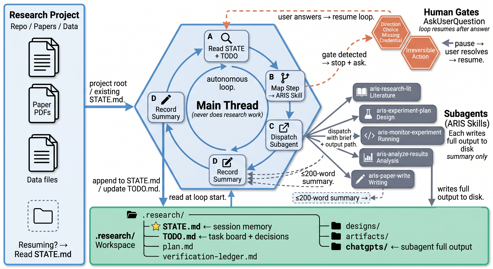

<div align="center">

# research-orchestrator

**A Claude Code skill that runs research projects as a lean orchestrator.**  
The main thread only plans, dispatches, verifies, and records — never does research work itself.  
All work is delegated to subagents that write to disk and return compact summaries, so your  
conversation stays navigable months into a project.

[](LICENSE)
[](https://claude.ai/code)
[](#academic-skills)

</div>

---

## Contents

- [The problem](#the-problem)
- [Install](#install)
- [How it works](#how-it-works)
- [What it does](#what-it-does)
- [Design principles](#design-principles)
  - [Evidence-gating](#evidence-gating----nothing-enters-state-as-fact-without-proof)
  - [Citation PDF verification](#citation-pdf-verification----every-reference-is-downloaded-and-checked)
  - [ChatGPT cross-analysis](#chatgpt-cross-analysis----adversarial-second-opinion-for-high-stakes-decisions)
  - [Human gates](#human-gates----autonomous-loop-with-hard-stops-at-irreversible-decisions)
  - [Clean main thread](#clean-main-thread----the-orchestrator-never-does-the-work)
  - [Persistent workspace + TODO](#persistent-workspace--running-todo----single-source-of-truth-across-all-sessions)
  - [Competitive intelligence sweep](#competitive-intelligence-sweep----no-direction-chosen-blind)
  - [Venue-standard quality + figures](#venue-standard-quality--figure-discipline----held-to-neuripsicmlcvpracl-bar)
- [Evidence system](#evidence-system)
- [Competitive intelligence sweep](#competitive-intelligence-sweep)
- [Human gates](#human-gates)
- [Workspace](#workspace)
- [Academic skills](#academic-skills)
- [Requirements](#requirements)
- [Repo layout](#repo-layout)
- [Limitations](#limitations)
- [License](#license)

---

## The problem

Long research projects break single-conversation LLM sessions: context fills with irrelevant detail, and 30 steps in you've lost the thread.

`research-orchestrator` fixes this by keeping the main thread plan-only. Every task dispatches to a subagent that writes full output to disk and returns only a ≤200-word summary.

---

## Install

```bash
git clone https://github.com/HaochenSHI66/research-orchestrator \
  ~/.claude/skills/research-orchestrator
```

Then, inside any research project:

```
/research-orchestrator
```

The skill reads `.research/STATE.md`, picks up where you left off, and keeps moving.

---

## How it works



The orchestrator never does research work itself. It decides what happens next, briefs a subagent, and records the outcome. That's the entire job.

### The dispatch contract

Every subagent gets a self-contained brief:

```
Context: <2–3 sentences — the subagent can't see the main conversation>
Task: <specific, bounded unit of work>
Skill: invoke `aris-xxx` for this
Output path: .research/artifacts/xxx.md
Return ONLY:
  1. ≤200-word summary
  2. Artifact path(s)
  3. Evidence for each load-bearing claim [verified] / [sourced] / [assumption]
  4. Skills/tools actually used
  5. Any decision the orchestrator now needs
  6. Confidence / risk flag
```

This contract is what keeps the main thread clean. A subagent's full notes, code, logs, and drafts stay on disk. Only the summary comes back.

---

## What it does

| | |
|---|---|
| **Autonomous loop** | Runs through ordinary work without stopping. Pauses only at genuine human gates: direction choices, missing credentials, interactive logins, irreversible actions. |
| **Persistent workspace** | Plans, designs, and decisions — including options that lost — are all kept under `.research/`. Every session reads `STATE.md` first. |
| **Running TODO** | `TODO.md` is updated every loop iteration with status, locked decisions, and open questions — single source of truth for the whole project. |
| **Stage → skill mapping** | Each research stage auto-maps to the matching ARIS academic skill. Ideation, literature, experiments, writing, review, rebuttal — all covered. |
| **ChatGPT cross-analysis** | Required (not optional) for any soundness claim — novel? sound? claim follows from results? Runs via codex MCP at `xhigh` reasoning, saved to `.research/chatgpt/`. |
| **Competitive sweep** | Before any new direction, fans out parallel subagents to map existing literature and surface direct overlap, competitive risk, and open gaps. |

---

## Design principles

Every concern below is enforced at runtime — gates block progress, loops update state, and the workspace records everything. Click the reference link to read the full specification.

---

### Evidence-gating — nothing enters STATE as fact without proof

The most common failure in AI-assisted research: a subagent asserts something, the orchestrator records it, and the error propagates invisibly for 10 more steps. This skill treats every subagent summary as a claim, not proof.

- All load-bearing claims tagged `[verified: file:line]`, `[sourced: url]`, or `[assumption: model-prior]`
- Every claim tracked in `verification-ledger.md`; status stays `unverified` until evidence is supplied
- **Hard no-pass gate**: no expensive or irreversible action (compute, push, submit) proceeds while any claim it depends on is unverified or refuted
- An `[assumption]` may never be silently promoted to fact — it becomes a human gate

→ `SKILL.md` § *The second rule: evidence over assertion* · `SKILL.md` § *The verification ledger and the no-pass gate*

---

### Citation PDF verification — every reference is downloaded and checked

Most tools trust abstracts or metadata. This skill runs a four-gate pipeline on every citation before it can appear in a draft.

- Resolve via DOI / arXiv / Semantic Scholar to canonical paper
- Fuzzy-match title, authors, year for metadata integrity
- Download the actual PDF (via Unpaywall or open-access sources)
- Extract text and confirm the specific claim the citation is meant to support
- Five outcomes: `VERIFIED`, `EXISTS-BUT-UNCHECKED`, `METADATA-MISMATCH`, `CLAIM-UNSUPPORTED`, `NOT-FOUND` — a draft never ships with anything other than `VERIFIED`

→ `SKILL.md` § *References: download and verify* · [`references/citation-verification.md`](references/citation-verification.md)

---

### ChatGPT cross-analysis — adversarial second opinion for high-stakes decisions

For decisions where a wrong answer costs weeks (is this novel? is this design sound? does this claim follow from the results?), a second independent model is more valuable than another pass from the same one.

- Runs via the **codex MCP server** inside a subagent — exchange never lands in the main thread
- Model: `gpt-5.5`, reasoning effort: `xhigh` — strongest available reviewer, not a quick sanity check
- Prompted to **refute**, not praise — disagreement is the signal, not a problem to resolve away
- Required (not optional) for any soundness claim: design, formula, experimental protocol, novelty assertion
- Method/design choices need **both** an independent refutation subagent AND this codex cross-analysis to pass

→ `SKILL.md` § *ChatGPT cross-analysis* · `SKILL.md` § *Design / experiments / formulas: both must confirm*

---

### Human gates — autonomous loop with hard stops at irreversible decisions

The skill loops without interruption through ordinary work. It stops only when a wrong guess cannot be corrected cheaply.

| Gate | Trigger |
|------|---------|
| Direction choice | Multiple viable directions; choice changes everything downstream |
| Benchmark protocol | No existing benchmark measures the claimed contribution |
| Missing credential | API key, dataset token, cluster login, codex MCP auth |
| Interactive auth | Browser or terminal login required (OAuth, 2FA, `gcloud auth login`) |
| Irreversible action | Delete, push, submit, spend — any action that can't be undone |
| Unverified claim | Ledger has an open item a planned step depends on |

Multiple visible gates are batched into one question. Session state is written clean before every stop so the next turn or session can resume exactly.

→ `SKILL.md` § *Human gates — the only reasons to stop*

---

### Clean main thread — the orchestrator never does the work

The main conversation handles one thing: deciding what happens next. Every execution task is a subagent.

- Each subagent gets a self-contained brief with context, task, ARIS skill to invoke, and output path
- Subagent returns ≤200-word summary + artifact paths + evidence; full output stays on disk in `artifacts/`
- Independent tasks fan out in a single message (parallel dispatch); dependent tasks run sequentially
- Research stages map to ARIS skills automatically via `stage-skill-map.md` — the orchestrator follows the map, not ad-hoc choices

→ `SKILL.md` § *The one rule that makes this work* · `SKILL.md` § *Dispatching a subagent — template* · [`references/stage-skill-map.md`](references/stage-skill-map.md)

---

### Persistent workspace + running TODO — single source of truth across all sessions

Every session starts by reading state, not by asking the user what's going on.

- `STATE.md` — reconciled against `git log` and disk on every session start; disagreements surfaced before any work begins
- `TODO.md` — updated every loop iteration with `[x]` / `[~]` / `[ ]` / 🚪 status, locked decisions with rationale, and open questions for the user
- Superseded decisions are struck through and annotated, never deleted — the history of what was tried and rejected is part of the record
- Design docs versioned by filename (`v1.md`, `v2.md`) and never overwritten in place
- `decisions/` holds one entry per human-gate decision: the options considered, the choice made, and why

→ `SKILL.md` § *Todolist* · `SKILL.md` § *Recording designs and decisions* · [`references/workspace-layout.md`](references/workspace-layout.md)

---

### Competitive intelligence sweep — no direction chosen blind

Before committing to any research direction (or after a topic pivot), the skill runs a mandatory literature sweep and presents a positioning map.

- Identifies top 2–3 venues for the area
- Fans out 3–5 parallel subagents across keyword angles using `aris-semantic-scholar`, `aris-openalex`, `aris-arxiv`; each downloads PDFs
- One subagent per paper extracts contribution, method, benchmarks, results, limitations
- Synthesis subagent builds a contribution-space table with an explicit verdict: *direct overlap* / *competitive risk* / *gap filler* / *novel axis*
- Direction choice is always a human gate — positioning map presented first, never picked silently
- Benchmark decision flows from the map: existing benchmarks reused by default; deviation requires documented justification

→ `SKILL.md` § *Competitive intelligence sweep — mandatory before any direction gate*

---

### Venue-standard quality + figure discipline — held to NeurIPS/ICML/CVPR/ACL bar

Every project is held to the submission standards of a top CS venue. These are gates, not aspirations.

- Every design constant needs a derivation, or a sensitivity sweep + ablation; if neither exists, that's a finding, not a detail
- Gains attributed to tuning or compute (not the idea) are flagged and separated
- Single-run results, weak baselines, data leakage, missing closest prior work, and overclaiming are all caught by the reviewer-attack checklist before the writing stage
- All figures produced via the `paper-plot-from-data` skill for consistent style and palette across the paper
- Every paper targets a diverse set of figure types: schematic, quantitative, ablation, qualitative/failure, convergence — not repetitive
- Tables follow the LaTeX template in `figure-discipline.md`: booktabs, no vertical rules, `\rowcolor` for proposed method, captions above

→ `SKILL.md` § *Held to top CS-venue standards* · [`references/reviewer-attack-checklist.md`](references/reviewer-attack-checklist.md) · [`references/figure-discipline.md`](references/figure-discipline.md)

---

## Evidence system

One of the most common ways AI-assisted research goes wrong: a subagent asserts something, the orchestrator records it as fact, and the error propagates invisibly through every downstream step.

`research-orchestrator` treats every subagent summary as a **claim**, not proof. Before anything load-bearing enters `STATE.md`, a design doc, or a decision, it needs evidence:

| Tag | Meaning |
|-----|---------|
| `[verified: file:line]` | Checked against a real artifact — a file quote, test output, run log |
| `[sourced: url]` | Claim about the outside world — fetched this session, not from model memory |
| `[assumption: model-prior]` | Not yet verified — must be resolved before it can drive an expensive decision |

An `[assumption]` is never silently promoted to fact. If a step depends on an unverified claim, that's a human gate — not something to paper over.

All load-bearing claims are tracked in `.research/verification-ledger.md`. No expensive or irreversible action (compute spend, submission, push) proceeds while the ledger has open `unverified` items.

---

## Competitive intelligence sweep

Before the first direction choice on any new project (or after a topic pivot), the orchestrator runs a mandatory sweep:

1. **Identify venues** — top 2–3 conferences/journals for the area
2. **Parallel paper collection** — 3–5 subagents fan out across keyword angles using `aris-semantic-scholar`, `aris-openalex`, `aris-arxiv`; each downloads the top matching PDFs
3. **Per-paper analysis** — one subagent per paper extracts contribution, method, benchmarks, results, and limitations
4. **Positioning map** — a synthesis subagent builds a contribution-space table and delivers a verdict: direct overlap / competitive risk / gap filler / novel axis
5. **Human gate** — the map is presented to the user; direction is never chosen silently

The goal is that no direction is picked with unknown competitive risk. The positioning map also drives the benchmark decision: reuse existing benchmarks unless they provably can't measure the claimed contribution.

---

## Human gates

The orchestrator loops autonomously through ordinary work. It stops **only** when a wrong guess would be expensive or irreversible:

| Gate | When it fires |
|------|--------------|
| **Direction choice** | Multiple viable framings/methods; choice changes everything downstream |
| **Benchmark protocol** | No existing benchmark can measure the claimed contribution |
| **Missing credentials** | A step needs an API key, dataset token, or cluster login |
| **Interactive auth** | Something needs a human at a browser (OAuth, 2FA, `gcloud auth login`) |
| **Irreversible action** | Deleting files, pushing, submitting, spending money |
| **Unverified load-bearing claim** | The ledger has an open item that a planned step depends on |

Everything else — keep going. "Should I run the next step?" is not a gate. When multiple gates are visible ahead, they're batched into one question so the user isn't pinged repeatedly.

---

## Workspace

Bootstrapped on first run:

```
.research/
├── STATE.md               ← current-state snapshot; first thing every session reads
├── TODO.md                ← running task board + locked decisions + open questions
├── plan.md                ← living master plan (high-level milestones)
├── verification-ledger.md ← status of every load-bearing claim
├── designs/               ← design docs, versioned, never overwritten
├── decisions/             ← one entry per human-gate decision (options, choice, rationale)
├── competitive-sweep/     ← positioning map + per-paper analyses
├── artifacts/             ← subagent working outputs
└── chatgpt/               ← ChatGPT cross-analysis exchanges
```

`TODO.md` is the project's single source of truth — it tracks tasks, records locked decisions with rationale, and lists open questions for the user. It's updated every loop iteration so it always reflects reality.

`designs/` is versioned by filename (`exp-design-v1.md`, `v2.md`) and never overwritten. Old versions stay — the history of what was tried and rejected is part of the project record.

---

## Academic skills

The stage → skill map targets the **ARIS** family (`aris-*`). Falls back to `scholar-*` / `arl-*` / `phd-*` if ARIS isn't installed — orchestration still works either way.

| Stage | Skills |
|---|---|
| Ideation | `aris-idea-discovery`, `aris-idea-creator`, `aris-novelty-check` |
| Literature | `aris-research-lit`, `aris-openalex`, `aris-semantic-scholar`, `aris-arxiv` |
| Experiment design | `aris-experiment-plan`, `aris-ablation-planner` |
| Running & monitoring | `aris-monitor-experiment` |
| Analysis | `aris-analyze-results`, `aris-result-to-claim` |
| Writing | `aris-paper-write`, `aris-paper-plan`, `aris-paper-figure` |
| Review & audit | `aris-citation-audit`, `aris-paper-claim-audit`, `aris-auto-review-loop` |
| Rebuttal | `aris-rebuttal`, `aris-resubmit-pipeline` |

The orchestrator never invokes these itself — it tells each dispatched subagent which skill to run. The subagent runs it in its own context. See [`references/stage-skill-map.md`](references/stage-skill-map.md) for the full mapping.

---

## Requirements

- **Claude Code** with the `Agent` tool — *required*; without subagent support the skill is non-functional
- **ARIS skills** — *recommended*; without them falls back to `scholar-*` / `arl-*` / `phd-*` or generic subagents; literature depth and review quality degrade
- **codex MCP server** — *required for autonomous soundness decisions*; without it every novelty/design-validity check becomes a human gate the loop cannot pass autonomously
- **Network + PDF access** — *required* for citation verification, arXiv/Semantic Scholar sweeps, and Unpaywall downloads; air-gapped environments will trigger gate pauses

---

## Repo layout

```
research-orchestrator/
├── SKILL.md                         ← the skill (orchestrator logic)
├── references/
│   ├── stage-skill-map.md           ← research stage → ARIS skill mapping
│   ├── workspace-layout.md          ← .research/ structure + file templates
│   ├── reviewer-attack-checklist.md ← what top-venue reviewers attack
│   ├── figure-discipline.md         ← figure/table standards
│   └── citation-verification.md     ← citation verification protocol
└── README.md
```

---

## Limitations

- **Token cost**: the competitive sweep fans out 3–5 parallel subagents each downloading and parsing PDFs; a full direction sweep can cost $5–20 in API tokens. Complex stages (review loop, ablation planning) with many concurrent subagents can push a full session past $50.
- **codex MCP is a hard dependency for soundness**: without it, any soundness-critical decision (novelty, design validity, claim follows from results) becomes a human gate — the loop cannot proceed autonomously past it.
- **Subagent summaries are not guaranteed accurate**: if a subagent hallucinates or misreads a paper, the error propagates unless evidence-gating catches it. The ledger and provenance tags reduce this risk but do not eliminate it.
- **Network and PDF access required**: citation verification, literature sweeps, and Unpaywall downloads all require outbound internet; paywalled papers fall back to `EXISTS-BUT-UNCHECKED` status.
- **Long projects accumulate state**: after many sessions, `.research/` can grow large; periodic manual archiving of `artifacts/` and completed decisions is recommended.
- **No automatic rollback**: the workspace records everything but does not version-control it automatically; corrupted `STATE.md` or design docs require manual recovery.

---

## License

MIT — see [LICENSE](LICENSE).
